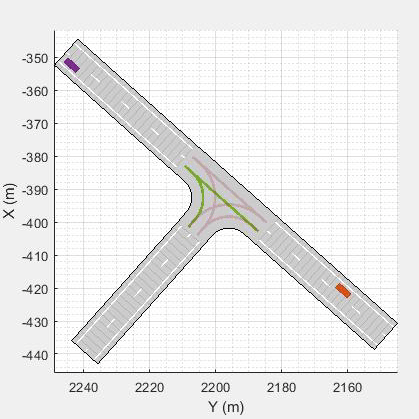
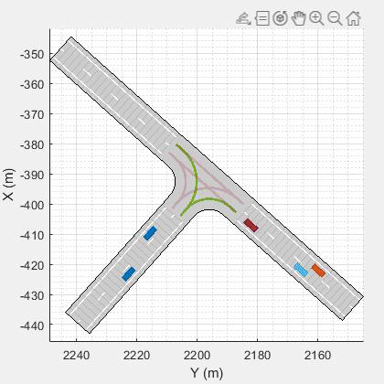
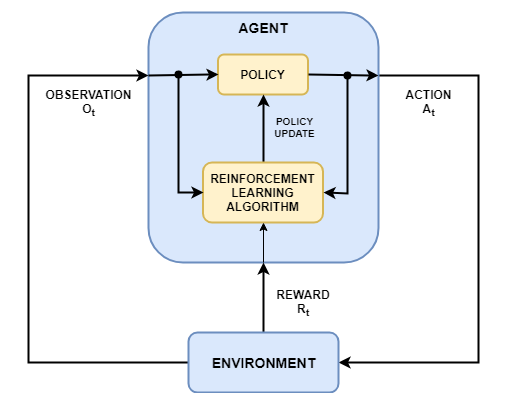
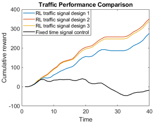

# Agent-based Traffic Signal Management System by Model-free Reinforcement Learning

- Author: Tanishq Chauhan
- Email: chauhantanishq1632@gmail.com 

## Overview

### **Traffic Management System: A Reinforcement Learning Approach**  
Traffic congestion remains a pressing issue in metropolitan cities across India, significantly impacting daily life. Addressing this challenge, the objective of this project is to develop an **intelligent traffic signal management system** to improve urban mobility. The system aims to:  
- Alleviate traffic congestion.  
- Reduce waiting times at intersections.  
- Enhance road network throughput.  
- Minimize collisions and improve overall traffic flow.  

Unlike traditional traffic signal systems that rely on optimization algorithms and predefined models, this solution leverages **Reinforcement Learning (RL)**, a cutting-edge AI technique. RL enables the system to learn optimal traffic signal timings through **trial-and-error interactions with the environment**, eliminating the need for complex traffic modeling. This human-centric, adaptive approach dynamically responds to real-time traffic conditions.  

### **Key Features**  
- **Adaptive Traffic Control:** Learns and adjusts signal timings to match varying traffic patterns.  
- **Real-Time Optimization:** Reduces delays, improves vehicle speeds, and avoids congestion.  
- **Scalable and Flexible Design:** Users can customize traffic signal designs and test different RL algorithms.  
- **Significant Improvements:** Demonstrates reduced waiting times, higher throughput, and improved collision avoidance.  

### **About**  
This repository showcases the design and implementation of the RL-based traffic signal control system, aligning with **Sustainable Development Goal 11**: Sustainable Cities and Communities. Key components include:  
1. **Traffic Signal Design:** Three distinct intelligent traffic signal configurations.  
2. **Learning Environment:** An interface to define custom traffic signal setups and experiment with RL algorithms.  
3. **Performance Metrics:** Evaluates the effectiveness of the RL approach with measurable improvements in traffic flow and safety.  

By combining artificial intelligence with urban traffic management, this project aims to transform Delhi's transportation infrastructure into a **model of sustainable, citizen-centric urban governance**.  

--- 

&nbsp;&nbsp;&nbsp;&nbsp;&nbsp;&nbsp;&nbsp;&nbsp;&nbsp;&nbsp;&nbsp;&nbsp;&nbsp;&nbsp;&nbsp;&nbsp;&nbsp;&nbsp;&nbsp;&nbsp;&nbsp;&nbsp;&nbsp;&nbsp;&nbsp;&nbsp;&nbsp;&nbsp;&nbsp;&nbsp;&nbsp;&nbsp;&nbsp;&nbsp;&nbsp;&nbsp;**Training Stage**

  

&nbsp;&nbsp;&nbsp;&nbsp;&nbsp;&nbsp;&nbsp;&nbsp;&nbsp;&nbsp;&nbsp;&nbsp;&nbsp;&nbsp;&nbsp;&nbsp;&nbsp;&nbsp;&nbsp;&nbsp;&nbsp;&nbsp;&nbsp;&nbsp;&nbsp;&nbsp;&nbsp;&nbsp;&nbsp;&nbsp;&nbsp;&nbsp;&nbsp;&nbsp;&nbsp;&nbsp;**Trained Agent**

## Getting Started
The introduction and detailed step-by-step instructions can be found from MATLAB Live Script: masterLiveScript.mlx **preferred**. Alternatively, you can also start with master.m, which is a MATLAB script **viewable on GitHub**.

The workflow of the developing process mainly involves five steps:

- Step 1: create an environment interface from MARTO specialized traffic simulator. For more information on the simulator, see [OpenTrafficLab](https://github.com/mathworks/OpenTrafficLab).
- Step 2: specify traffic problem formulation, including observation space, traffic signal phase design (action), and reward function. 
- Step 3: create deep Q-network (DQN) agent. A list of other agent options can be found [here](https://www.mathworks.com/help/reinforcement-learning/agents.html?s_tid=CRUX_lftnav).
- Step 4: specify the training options and train the agent.
- Step 5: validate the performance of the trained agent. 
## Dependencies
This model has been tested with MATLAB R2023b. The version tested with MATLAB R2023a is being developed. Here is a list of products required to run:
- [Reinforcement Learning Toolbox](https://www.mathworks.com/products/reinforcement-learning.html)TM
- [Automated Driving Toolbox](https://www.mathworks.com/products/automated-driving.html)TM
- [Parallel Computing Toolbox](https://www.mathworks.com/products/parallel-computing.html)TM

<!--  -->

